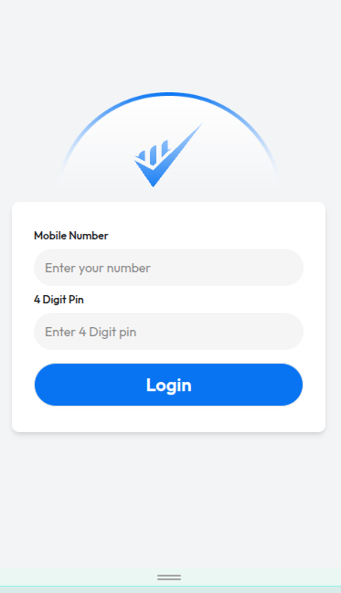

# Project Name: 

## Project Description: 

## Live Site Link:

## Project Video:


## What I Learned New while Building This Project:

1. How to customization tailwind CSS:  
```css
    <style type="text/tailwindcss">
        @theme {
        --color-primary: #FF2800;
      }
    </style>
```  
2. If we want to handle toggle using tailwind CSS, we have to use if-else and add and remove: 
```js
function handleToggle(id, status) {
    const element = document.getElementById(id);

    if (status === "block") {
        element.classList.remove("hidden");
        element.classList.add("block");
    }
    else if (status === "hidden") {
        element.classList.remove("block");
        element.classList.add("hidden");
    }
}
```
but if we used raw css instead of tailwind css, then  we don't need extra if-else block: 
```js
function handleToggle(id, status) {
    document.getElementById(id).style.display = "status";
}
```

3. How to redirect one html file to another html file using ```window.location.href``` properties.


## Challenges I faced while Building This Project:

1. I spent several hours designing the login page. At first, I couldn’t make it vertically and horizontally centered. Then I struggled with positioning the logo image with a background properly.  
   



## Contact With Me: 

[](mailto:contact2tamim@gmail.com)
[](https://www.linkedin.com/in/tamim-muhammad/)

---

### Thank you so much for checking out my project! If you have any suggestions or feedback, feel free to share them.

